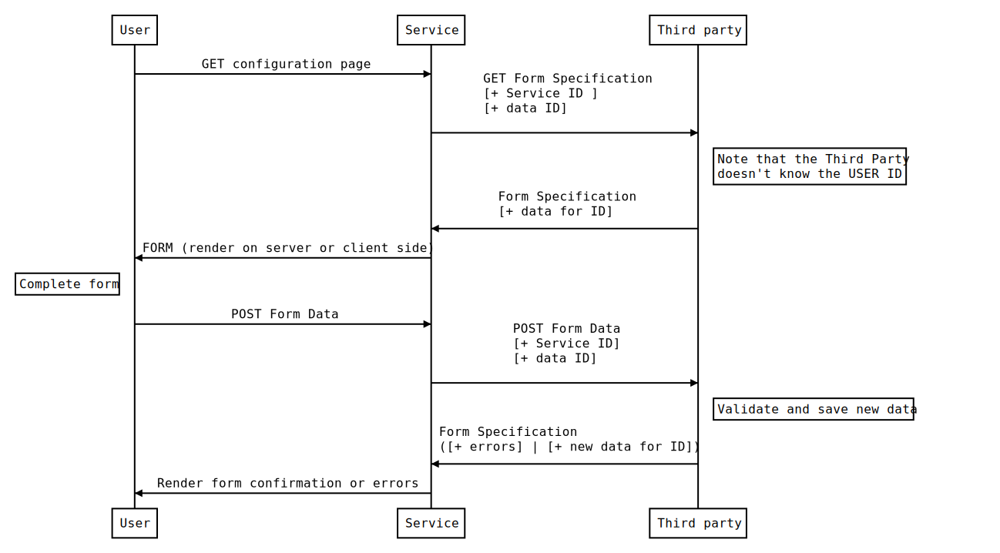

# Form Specification

## Introduction

The Form Specification defines a standard, language-independent, human-readable interface for defining forms that allows a service to include a third-party form without interfering with the aspect of its application.

## Table of Contents

* [Specification](#specification)
  * [Format](#fotmat)
  * [Disambiguation](#disambiguation)
  * [Schema](#Schema)
    * [Form Object](#form-object)
    * [Section Object](#section-object)
    * [Input Object](#input-object)
    * [Validation Object](#validation-object)
    * [Match Object](#match-object)
    * [Change Object](#change-object)
* [Flow](#flow)

### Format

A Form Specification document is itself a JSONx object, which may be represented either in JSON or YAML format.

### Disambiguation

In order to avoid confusion, from now on, use will be made of:

* **Service**: As the service provided by a person or company and that interacts with one or more third parties
* **Application**: As the UI with which the user interacts
* **Third Party**: As a person or company that require specific user information and they need a non-programmatic way of getting it
* **User**: As the person who interacts with the application

### Schema

In the following description, if a field is not explicitly **REQUIRED** or described with a MUST or SHALL, it can be considered OPTIONAL.

#### Form Object

This is the root document object

##### Form Object Fields

Field Name | Type | Description
---|:---:|---
title | `string` | A title for the form.
description | `string` | A description for the form. [CommonMark syntax](http://spec.commonmark.org/) MAY be used for rich text representation.
hint | `string` | A relevant note that the third-party want to communicate to de the user. [CommonMark syntax](http://spec.commonmark.org/) MAY be used for rich text representation.
warning | `string` | An warning that the third-party want to communicate to de the user, but that does not prevent submit the form data. [CommonMark syntax](http://spec.commonmark.org/) MAY be used for rich text representation.
error | `string` | An error that prevents sending the form. [CommonMark syntax](http://spec.commonmark.org/) MAY be used for rich text representation.
sections | [[`Section Object`](#section-object)] | **REQUIRED** A list of sections for the form
validations | [[Validation Object](#validation-object)] | A list of validation that allow to the third-party to modify the form based on data completed by the user

##### Form Object Example

```json

{
    "title": "Contact info",
    "description": "Complete the following form and we will contact you as soon as possible.",
    "hint": "Our service hours are from 9:00 a.m. to 6:00 p.m.",
    "warning": "We are currently closed",
    "error": "We could not access your data",
    "sections": [],
    "validations": [],
}

```

```yaml

title: 'Contact info'
description: 'Complete the following form and we will contact you as soon as possible.'
hint: 'Our service hours are from 9:00 a.m. to 6:00 p.m.'
warning: 'We are currently closed'
error: 'We could not access your data'
sections:
  -
validations:
  -

```

#### Section Object

This object define each section on the form

##### Section Object Fields

Field Name | Type | Description
---|:---:|---
name | `string` | Name for the section. It is **NOT REQUIRED** but there **SHOULD NOT** be two sections with the same name
title | `string` | A title for the section.
description | `string` | A description for the section. [CommonMark syntax](http://spec.commonmark.org/) MAY be used for rich text representation.
hint | `string` | A relevant note that the third-party want to communicate to de the user. [CommonMark syntax](http://spec.commonmark.org/) MAY be used for rich text representation.
warning | `string` | An warning that the third-party want to communicate to de the user, but that does not prevent submit the form data. [CommonMark syntax](http://spec.commonmark.org/) MAY be used for rich text representation.
error | `string` | An error that prevents sending the form. [CommonMark syntax](http://spec.commonmark.org/) MAY be used for rich text representation.
inputs | [[`Input Object`](#input-object)] | A list of inputs that appear in the section of the form.
hidden | `boolean` | Defines if the section is visible.
hiddenWhere | [`Match Object`](#match-object) | Defines if the section is visible depending on the data loaded by the user *(it is ignored if hidden is true)*.
disabled | `boolean` | Defines if the section is disabled.
disabledWhere | [`Match Object`](#match-object) | Defines if the section is disabled depending on the data loaded by the user *(it is ignored if disabled is true)*.

> Note: the `hidden` and `disabled` properties are static and can only be changed through a [`Validation`](#validation-object) (executed when the form is submitted) instead `hiddenWhere` and `disabledWhere` are checked each time the user changes any value


##### Section Object Example

```json

{
    "name": "personalInformation",
    "title": "Do you want us to contact you?",
    "hint": "We will not share your information with anyone",
    "inputs": []
}

```

```yaml

name: 'personalInformation'
title: 'Do you want us to contact you?'
hint: 'We will not share your information with anyone'
inputs:
  -

```

#### Input Object

This object define each input for a section

##### Input Object Fields

Field Name | Type | Description
---|:---:|---
name | `string` | **REQUIRED** Name for the input and represents the position in the data by dot notation.
type | `string` | **REQUIRED** It is a string that is defined by the service and represents the data type that will be sent in as data.
label | `string` | Reference for the user.
hint | `string` | A relevant note that the third-party want to communicate to de the user.
warning | `string` | An warning that the third-party want to communicate to de the user, but that does not prevent submit the form data.
error | `string` | An error that prevents sending the form.used for rich text representation.
hidden | `boolean` | Defines if the section is visible.
hiddenWhere | [`Match Object`](#match-object) | Defines if the section is visible depending on the data loaded by the user *(it is ignored if hidden is true)*.
disabled | `boolean` | Defines if the section is disabled.
disabledWhere | [`Match Object`](#match-object) | Defines if the section is disabled depending on the data loaded by the user *(it is ignored if disabled is true)*.
customProps | `Object` | An object that is defined by the service and that the third-party can use to configure the behavior of the input.

> Note: the `hidden` and `disabled` properties are static and can only be changed through a [`Validation`](#validation-object) (executed when the form is submitted) instead `hiddenWhere` and `disabledWhere` are checked each time the user changes any value

##### Input Object Example

```json

{
    "name": "user.age",
    "type": "number",
    "label": "Age",
    "customProps": {
        "minValue": 13,
        "maxValue": 100,
    }
}

```

```yaml

name: 'user.age'
type: 'number'
label: 'Age'
customProps:
  minValue: 13
  maxValue: 100

```

#### Validation Object

This object allows you to apply changes to a named component or Form Object based on the information submitted by the user

##### Validation Object Fields

Field Name | Type | Description
---|:---:|---
where | [`Match Object`](#match-object) | Object used to define when I should apply the changes.
changes | [[`Cahnge Object`](#change-object)] | A list of changes.

##### Validation Object Example

```json

{
    "where": {
        "user.age": { "$lt": 18 }
    },
    "changes": [
        {
            "name": "userSection",
            "warning": "This section contains errors"
        },
        {
            "name": "user.age",
            "error": "You must be of legal age",
        }
    ]
}

```

```yaml

where:
    user.age:
        $lt: 18
changes:
    - name: 'userSection'
      warning: 'This section contains errors'
    - name: 'user.age'
      error: 'You must be of legal age'

```

#### Match Object

A Match object is a customizable super set of a [MongoDB Query](https://docs.mongodb.com/manual/reference/operator/query).
Each service can offer its own operators to interact with the information.
In any case, the following extensions are recommended:

##### Match Object `$empty` operator

```javascript
    // Syntax:
    { field: { $empty: <boolean> } }
```

When <boolean> is true, `$empty` matches the documents that not contain the field, that field value is `null`, `undefined`, `""` (empty string), `[]` (empty array) or `NaN`. If <boolean> is false, matches all the rest.


##### Match Object `$empty` example

```json

{
   "user.name": {
       "$empty": true
   }
}

```

```yaml

user.age:
    $empty: true

```

##### Match Object `$falsy` operator

```javascript
    // Syntax:
    { field: { $falsy: <boolean> } }
```

When <boolean> is true, `$falsy` matches the documents that not contain the field, that field value is `null`, `undefined`, `""` (empty string), `[]` (empty array), `false`, `0`, or `NaN`. If <boolean> is false, matches all the rest.

##### Match Object `$falsy` example

```json

{
   "user.name": {
       "$falsy": true
   }
}

```

```yaml

user.age:
    $falsy: true

```

#### Change Object

This object allows you to apply changes to a named component or Form Object based on the information submitted by the user.

##### Change Object Fields

Field Name | Type | Description
---|:---:|---
name | `string` | The name of the input or the section to which the change will be applied.
hint | `string` | Message that will replace the initial `hint` of the section or the input.
warning | `string` | Message that will replace the initial `warning` of the section or the input.
error | `string` | Message that will replace the initial `error` of the section or the input.
customProps | `Object` | Object to be merged the initial `customProps` of the section or input.

##### Change Object Example

```json

{
    "name": "user.age",
    "error": "You must be of legal age",
    "customProps": {
        "customPropsForInput": "new value for this custom props"
    }
}

```

```yaml

name: 'user.age'
error: 'You must be of legal age'
customProps:
    customPropsForInput: 'new value for this custom props'

```

## Flow

This is the recommended flow to interact with form data submission

> 
